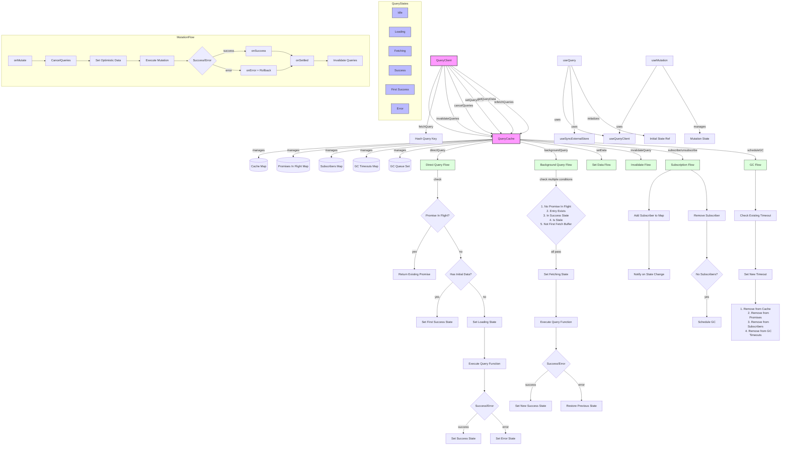

# TanStack Query from scratch

A scoped implementation of React Query to understand the core concepts.

## Core features

✅ Basic query caching  
✅ Optimistic updates  
✅ Error handling & rollback  
✅ Garbage collection  
✅ Background revalidation  
✅ Query invalidation  
✅ Deduplication of requests  
✅ Stale-while-revalidate pattern  
✅ Dependent queries  
✅ Parallel queries

## Get it up and running

```bash
git clone https://github.com/tigerabrodi/react-query-from-scratch
pnpm install
pnpm test
```

## Architecture for this implementation

The architecture here is different from the real TanStack query. The real one uses query observers that sit between the component and the query cache. You can read how it works here: [Inside React Query](https://tkdodo.eu/blog/inside-react-query). Their architecture is obviously more complex. It's nice though, because it's easy to create adapters for different frameworks.

### My architecture



# How they handle race conditions

One interesting thing is how the real TanStack Query handles race conditions. They use mutation scopes with queues, where only one mutation can be active per scope. That's how they prevent race conditions. See their [mutationCache.ts](https://github.com/TanStack/query/blob/main/packages/query-core/src/mutationCache.ts).

# Features missing

There is a lot of things that aren't implemented here that from the full TanStack Query implementation.

Query features:

- Prefetching queries (shouldn't be too tricky in hindsight with what I've done here)
- Query retries and retry config (we'd need to retry with exponential backoff)
- Window focus refetching (need to listen to window focus events)
- Network status refetching (need to listen to network status events)
- Polling/refetchInterval (something you'd configure in the query options)
- Infinite queries (for pagination/infinite scroll)
- Suspense queries

For `useSuspenseQuery`, we'd need to throw the promise. I dug into the source code before writing this, but their [useSuspenseQuery](https://github.com/TanStack/query/blob/main/packages/react-query/src/useSuspenseQuery.ts) hook is just a wrapper around `useBaseQuery` which they use. However, suspense is enabled. If it should suspense, they throw the fetch here: [useBaseQuery.ts#L116](https://github.com/TanStack/query/blob/main/packages/react-query/src/useBaseQuery.ts#L116). Very cool.

Mutation features:

- Mutation retries
- Race condition handling
- Mutation queues
- Mutation keys/scoping

---

For learning purposes, this implementation focuses on the core concepts while leaving out more advanced features.
